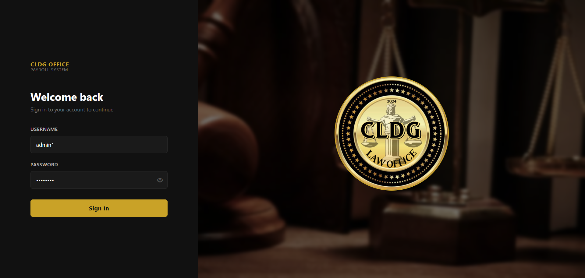
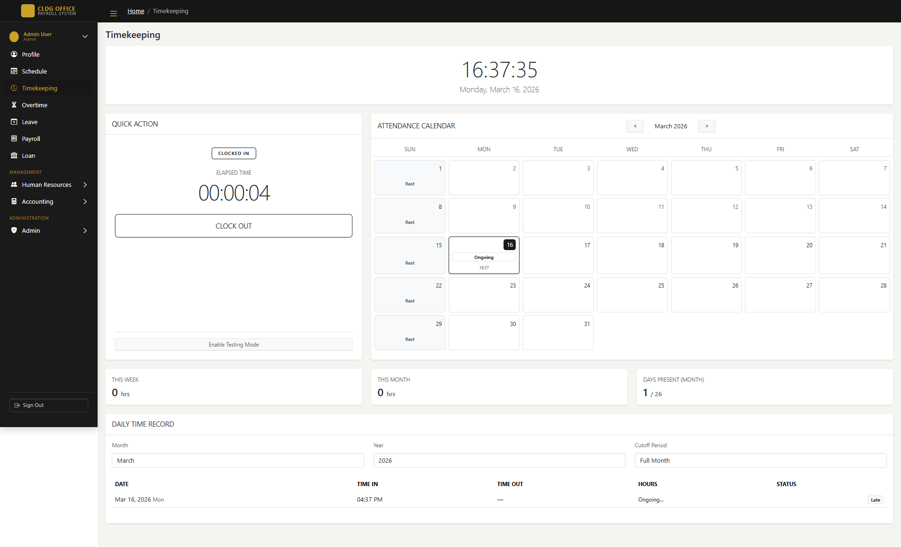

# 💼 CLDG Office Payroll System

A role-based **Payroll and HR Management System** built with **Laravel** and **Bootstrap 5**, designed to manage employee records, timekeeping, payroll processing, and HR operations across multiple branches.

---


---

## 📋 Table of Contents

- [About the Project](#about-the-project)
- [Screenshots](#screenshots)
- [Features](#features)
- [Tech Stack](#tech-stack)
- [Getting Started](#getting-started)
- [Folder Structure](#folder-structure)
- [User Roles](#user-roles)
- [License](#license)

---

## 📌 About the Project

**CLDG Office Payroll System** is a comprehensive web-based payroll and workforce management platform. It supports multiple user roles — Employee, HR, Accounting, and Admin — each with dedicated portals and access controls. The system handles everything from employee timekeeping and leave requests to payroll period processing and salary computation.

---

## 📸 Screenshots

> 📁 Place all your screenshots inside a `/screenshots` folder in the root of your repository.

| Page | Screenshot |
|------|------------|
| Login Page |  |
| Admin Dashboard |  |
| Employee Portal |  |
| Timekeeping |  |
| Payroll Period |  |
| HR – Team Attendance |  |
| HR – Requests |  |
| Admin – Departments |  |

> 💡 **Tip:** Use browser screenshots (Full Page) via DevTools or extensions like `GoFullPage` for Chrome.

---

## ✨ Features

### 👤 Employee Portal
- View and update personal **Profile**
- View assigned **Schedule**
- Track personal **Timekeeping** records
- File and monitor **Overtime** requests
- Submit and track **Leave** applications
- View **Payslip / Payroll** records
- Monitor **Loan** balances and history

### 🧑‍💼 Human Resources
- Manage **Employee** records
- Monitor **Team Attendance**
- Manage **Team Schedules**
- Process **Requests** (leave, overtime approvals)
- Manage employee **Loans**
- Generate HR **Reports**

### 🧾 Accounting
- Manage **Payroll Periods**
- Process and view **Salary** computations

### 🛡️ Admin
- Overview **Dashboard**
- Manage **Departments**
- Manage **Positions**
- Manage **Branches**
- Configure **System Settings**

---

## 🛠️ Tech Stack

| Layer | Technology |
|-------|-----------|
| Backend | Laravel (PHP) |
| Frontend | Bootstrap 5, Bootstrap Icons |
| Templating | Blade (Laravel) |
| Database | MySQL |
| Authentication | Laravel Auth with Role-Based Access |
| Server | Apache / Nginx |

---

## 🚀 Getting Started

### Prerequisites

- PHP >= 8.1
- Composer
- Node.js & NPM
- MySQL
- Laravel CLI

### Installation

```bash
# 1. Clone the repository
git clone https://github.com/your-username/cldg-payroll-system.git
cd cldg-payroll-system

# 2. Install PHP dependencies
composer install

# 3. Install Node dependencies
npm install && npm run dev

# 4. Copy environment file
cp .env.example .env

# 5. Generate application key
php artisan key:generate

# 6. Configure your .env database credentials
DB_DATABASE=your_database
DB_USERNAME=your_username
DB_PASSWORD=your_password

# 7. Run migrations and seeders
php artisan migrate --seed

# 8. Link storage
php artisan storage:link

# 9. Serve the application
php artisan serve
